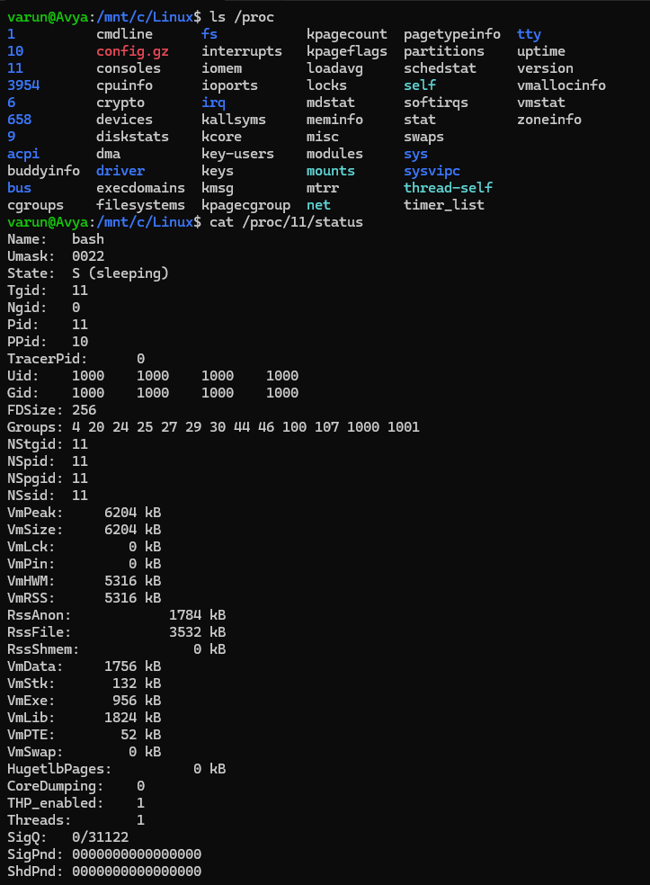
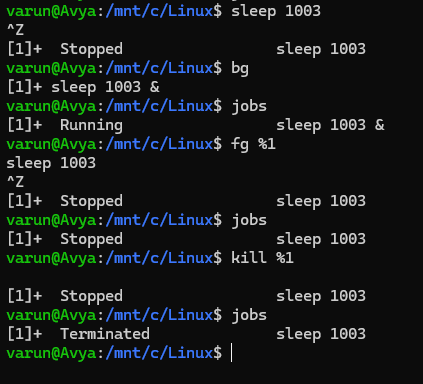

# 1. ps (Processes)
Processes are the programs that are running on your machine. They are managed by the kernel, and each process has an ID associated with it called the process ID (PID). This PID is assigned in the order that processes are created.
```bash
$ ps
PID        TTY     STAT   TIME          CMD
41230    pts/4    Ss        00:00:00     bash
51224    pts/4    R+        00:00:00     ps
```

##### 1. **PID (Process ID)**

* A unique number assigned by the kernel to each running process.
* Example: `41230` is your **bash shell**, `51224` is the **ps command** you just ran.

##### 2. **TTY (Controlling terminal)**

* The terminal that the process is attached to.
* `pts/4` means a **pseudo-terminal** (a virtual terminal, like an SSH session or a terminal window/tab).

##### 3. **STAT (Process status code)**

This shows the current state of the process (can have multiple letters):

* `S` → Sleeping (waiting for input or event)
* `R` → Running (actively executing on CPU)
* `+` → Process is in the foreground of the terminal
* `s` → Session leader (like a shell process that spawns other processes)

So:

* `Ss` = bash is **sleeping** and is a **session leader**.
* `R+` = ps is **running** right now in the **foreground**.


##### 4. **TIME (CPU time)**

* The total CPU time the process has consumed.
* Both are `00:00:00` because they’re lightweight and barely used CPU.

##### 5. **CMD (Command)**

* The actual command or executable that started the process.
* Here: `bash` (your shell) and `ps` (the command you just typed).

#### Flags
```bash
$ ps aux

USER       PID %CPU %MEM    VSZ   RSS TTY      STAT START   TIME COMMAND
root         1  0.0  0.0   2616  1748 hvc0     Sl+  05:50   0:00 /init
root         6  0.0  0.0   2616     4 hvc0     Sl+  05:50   0:00 plan9 --cont
root         9  0.0  0.0   2624   120 ?        Ss   05:50   0:00 /init
root        10  0.0  0.0   2624   128 ?        S    05:50   0:00 /init
varun       11  0.0  0.0   6204  5316 pts/0    Ss   05:50   0:00 -bash
root       658  0.0  0.0  13760  6364 pts/0    T    14:05   0:00 sudo /etc/sh
varun      687 66.6  0.0   8336  4164 pts/0    R+   17:37   0:00 ps aux
```
- `a` → show all processes, including other users.

- `u` → show them with user-oriented more details.

- `x` → include processes without a terminal (like background daemons).

   - These are usually background services (daemons) that start when the system boots (like `sshd`, `cron`, `systemd`).
   - Since they aren’t tied to any terminal window, their TTY field is `?` in `ps aux`.
   
#### Fields
1. **USER**: The effective user (the one whose access we are using)
2. **PID**: Process ID
3. **%CPU**: CPU time used divided by the time the process has been running
4. **%MEM**: Ratio of the process's resident set size to the physical memory on the machine
5. **VSZ**: Virtual memory usage of the entire process
6. **RSS**: Resident set size, the non-swapped physical memory that a task has used
7. **TTY**: Controlling terminal associated with the process
8. **STAT**: Process status code
9. **START**: Start time of the process
10. **TIME**: Total CPU usage time
11. **COMMAND**: Name of executable/command

## `Top`
Another very useful command is the `top` command. `top` gives you real-time information about the processes running on your system instead of a snapshot. By default, you'll get a refresh every 10 seconds. `top` is an extremely useful tool to see what processes are taking up a lot of your resources.
```bash
$ top

top - 17:47:37 up 11:56,  0 user,  load average: 0.00, 0.00, 0.00
Tasks:   7 total,   1 running,   5 sleeping,   1 stopped,   0 zombie
%Cpu(s):  0.0 us,  0.0 sy,  0.0 ni,100.0 id,  0.0 wa,  0.0 hi,  0.0 si,  0.0
MiB Mem :   7787.2 total,   7339.4 free,    503.8 used,    146.9 buff/cache
MiB Swap:   2048.0 total,   2048.0 free,      0.0 used.   7283.4 avail Mem

  PID USER      PR  NI    VIRT    RES    SHR S  %CPU  %MEM     TIME+ COMMAND
    1 root      20   0    2616   1748   1636 S   0.0   0.0   0:00.05 init(U+
    6 root      20   0    2616      4      0 S   0.0   0.0   0:00.00 init
    9 root      20   0    2624    120      0 S   0.0   0.0   0:00.00 Sessio+
   10 root      20   0    2624    128      0 S   0.0   0.0   0:00.48 Relay(+
   11 varun     20   0    6204   5316   3532 S   0.0   0.1   0:00.79 bash
  658 root      20   0   13760   6364   5428 T   0.0   0.1   0:00.06 sudo
  688 varun     20   0    9376   5184   3008 R   0.0   0.1   0:00.04 top


```
---
# 2. Controlling Terminal (TTY)
The TTY is the terminal that executed the command.


### Two kinds of terminals

1. **Regular terminal devices (TTY)**

   * The old-school "real" terminal (text-only console).
   * On Linux, you can still access these with **Ctrl+Alt+F1** to **Ctrl+Alt+F6** (tty1 to tty6).
   * They are labeled as `tty1`, `tty2`, etc.
   * No graphics, just text input/output.

2. **Pseudoterminals (PTS)**

   * Modern terminal emulators (like GNOME Terminal, xterm, Konsole, SSH sessions).
   * They *emulate* terminals in software.
   * In `ps`, they show up as `pts/0`, `pts/1`, etc. (pseudo-terminal slaves).

---

### What happens with controlling terminals

* If a process is bound to a controlling terminal:

  * Closing the terminal **kills the process** (e.g., you run `find` in your shell, then close the terminal — `find` dies too).

* If a process is **not bound** to a controlling terminal:

  * It runs independently of any terminal.
  * These are typically **daemon processes** (background services like `cron`, `sshd`, `systemd`).
  * In `ps`, their **TTY** is shown as `?`.

### Example

```
$ ps -eo pid,tty,stat,cmd | head
  PID TTY      STAT CMD
    1 ?        Ss   /sbin/init
 4134 pts/0    Ss   -bash
 4178 pts/0    R+   ps -eo pid,tty,stat,cmd
```

* `init` (`/sbin/init`) has **TTY = ?** → it’s a system daemon, no terminal.
* `bash` is tied to `pts/0`.
* `ps` is tied to `pts/0` (running in the foreground).

**note**
- `hvc` = hypercalls virtual console (sometimes called hypervisor virtual console).

- It shows up when Linux is running inside a virtualized environment (like WSL2, QEMU, KVM, Xen, or PowerPC hypervisors).
- Instead of a traditional `tty0` (physical console) or `pts/*` (pseudo-terminal), the kernel provides a virtual console device named `hvc0`.
---

# 3. Process Details
A process, as we said before, is a running program on the system. More precisely, it's the system allocating memory, CPU, and I/O to make the program run. A process is an instance of a running program.

The kernel is in charge of processes. When we run a program, the kernel loads up the code of the program in memory, determines and allocates resources, and then keeps tabs on each process. It knows:

- The status of the process
- The resources the process is using and receives
- The process owner
- Signal handling 

And basically everything else

When a process ends, the resources it used are now freed up for other processes.

---
# 4. Process Creation

### Fork System Call
- A new process is created using `fork()`.
- This makes a child process that is almost identical to the parent.
- Child process gets a new **PID** (Process ID).
- Parent process can be identified by the child’s **PPID** (Parent Process ID).

- Child can keep running the same program as the parent.
- More commonly → it calls execve() to replace its memory with a new program. Old memory setup is destroyed. New memory layout is set up for the new program.

### Viewing Parent–Child Relationships
Shows long format, including PPID column.

```
$ ps l
F S   UID   PID  PPID  C PRI  NI ADDR SZ WCHAN  TTY          TIME CMD
4 S  1000    11    10  0  80   0 -  1551 do_wai pts/0    00:00:00 bash
0 R  1000   692    11 99  80   0 -  2092 -      pts/0    00:00:00 ps
```
The `l` option gives us a "long format" or even more detailed view of our running processes. 

**Important**
- All processes come from a chain of forks.
- The very first process after boot is init (PID = 1).
- Runs as root, cannot be killed except when shutting down.
- Responsible for starting and managing system services.

---
# 5. Process Termination


## Notes: Process Termination

### 1. Normal Termination

* A process ends by calling the \`_exit` system call.
* This frees resources used by the process.
* The process reports a termination status to the kernel:

  * **0 → Success**
  * **Non-zero → Error/Failure**
* The **parent process** must acknowledge the child’s termination with the `wait` system call:

  * This lets the parent check how the child ended.
  * Without `wait`, the termination isn’t fully processed.


### 2. Termination by Signals

* Another way to stop a process is through signals .
* Example: `kill` command sends signals to terminate a process.


### 3. Orphan Processes

* If a **parent dies before its child**, the child becomes an **orphan**.
* The kernel reassigns orphans to `init` (PID 1).
* `init` later performs the `wait` call on their behalf.


### 4. Zombie Processes 

* A child **finishes execution**, but the parent hasn’t called **wait** yet.
* Child’s resources are freed, but an **entry remains in the process table**.
* Zombies:

  * Cannot be killed (they’re already dead).
  * Disappear once the parent calls `wait` → called **reaping**.
  * If parent ignores them, `init` adopts and reaps them.
* Too many zombies = process table fills up → prevents new processes.

---

# 6. Signals
A signal is a notification to a process that something has happened.

### Signal Process
When a signal is generated by some event, it is then delivered to a process; it is considered in a pending state until it is delivered.
 When the process is run, the signal will be delivered. However, processes have signal masks, and they can set signal delivery to be blocked if specified. When a signal is delivered, a process can do a multitude of things:

- Ignore the signal.
- "Catch" the signal and perform a specific handler routine.
- The process can be terminated, as opposed to the normal exit system call.
- Block the signal, depending on the signal mask.

### Common Signals
Each signal is defined by integers with symbolic names that are in the form of SIGxxx. Some of the most common signals are:

- SIGHUP or HUP or 1: Hangup
- SIGINT or INT or 2: Interrupt
- SIGKILL or KILL or 9: Kill
- SIGSEGV or SEGV or 11: Segmentation fault
- SIGTERM or TERM or 15: Software termination
- SIGSTOP or STOP: Stop

Numbers can vary with signals, so they are usually referred to by their names.

Some signals are unblockable; one example is the SIGKILL signal. The KILL signal destroys the process.

---
# 7. kill (Terminate)
You can send signals that terminate processes; such a command is aptly named the `kill` command.
```bash
$ kill 12445
```
The 12445 is the PID of the process you want to kill. By default, it sends a `TERM` / `SIGTERM` signal

```bash
$ kill -9 12445
```
This will run the `SIGKILL` signal and kill the process.

## Differences between SIGHUP, SIGINT, SIGTERM, SIGKILL, SIGSTOP?

- `SIGHUP` - Hangup, sent to a process when the controlling terminal is closed. For example, if you closed a terminal window that had a process running in it, you would get a `SIGHUP` signal. So, basically, you've been hung up on.
- `SIGINT` - Is an interrupt signal, so you can use Ctrl-C, and the system will try to gracefully kill the process.
- `SIGTERM` - Kill the process, but allow it to do some cleanup first.
- `SIGKILL` - Kill the process, kill it with fire, doesn't do any cleanup.
- `SIGSTOP` - Stop/suspend a process.

---

# 8. niceness

* **Every process has a niceness value (NI)** that tells the CPU scheduler how "important" it thinks it is.
* **Range:** `-20` (highest priority, greedy) → `19` (lowest priority, very nice).
* Default is usually **0**.

---

### How it works

* **Higher NI = more nice** → process steps back and lets others get CPU first.
* **Lower NI (negative) = less nice** → process demands more CPU time.

So:

* A **background task** (like a big file download or backup) should be “nice” → high NI.
* A **critical task** (like real-time video editing or gaming) might need a lower NI.


### Commands

* **Start new process with niceness**

  ```bash
  nice -n 5 apt upgrade
  ```

  (Runs `apt upgrade` with niceness 5)

* **Change niceness of running process**

  ```bash
  renice 10 -p 3245
  ```

  (Sets process 3245’s niceness to 10.)
---

# 9. Process States
- **R**: Running or runnable; it is just waiting for the CPU to process it.
- **S**: Interruptible sleep; waiting for an event to complete, such as input from the terminal.
- **D**: Uninterruptible sleep; processes that cannot be killed or interrupted with a signal. Usually, to make them go away, you have to reboot or fix the issue.
- **Z**: A zombie process is a process that has finished execution (it’s dead) but is still sitting in the process table because its parent hasn’t read its exit status yet.
- **T**: Stopped; a process that has been suspended/stopped.

---

# 10. /proc filesystem
Remember, everything in Linux is a file, even processes. Process information is stored in a special filesystem known as the /proc filesystem.
```bash
ls /proc
```

`/proc` is a virtual filesystem (it doesn’t exist on your disk, the kernel generates it in memory).

Inside /proc, there’s:
- One folder per process, named after its PID 
- Each folder has text files that describe the process (status, memory usage, open files, etc.)

Example:
```bash
$ cat /proc/11/status
```
This shows things like process name, PID, memory, state (Running, Sleeping, etc.).

#### Notes
And `/proc` isn’t just for processes — it also stores system-wide info:

- `/proc/cpuinfo` → details about your CPU

- `/proc/meminfo` → memory usage

- `/proc/uptime` → how long your system has been running



----
# 11. Job Control
### 1. Sending a job to the background\
Appending an ampersand `&` to the command will run it in the background so you can still use your shell.
Example
```bash
sleep 1000 &
sleep 1001 &
sleep 1002 &
```
### 2. View all background jobs
```bash
$ jobs

[1]    Running     sleep 1000 &
[2]-   Running     sleep 1001 &
[3]+   Running     sleep 1002 &
```
This will show you the job ID in the first column, then the status and the command that was run. 
 - The `+` next to the job ID means that it is the most recent background job that started. 
 - The job with the `-` is the second most recent command.

 ### 3. Sending a job to the background on an existing job
 If you already ran a job and want to send it to the background, suspend the job with Ctrl-Z, then run the bg command to send it to the background.

 ```bash
 varun@Avya:/mnt/c/Linux$ sleep 1003
^Z
[3]+  Stopped                 sleep 1003
varun@Avya:/mnt/c/Linux$ bg
[3]+ sleep 1003 &
varun@Avya:/mnt/c/Linux$ jobs
[1]-  Stopped                 sudo /etc/shadow
[2]+  Stopped                 sleep 100
[3]   Running                 sleep 1003 &
```

### 4. Moving a job from the background to the foreground
To move a job out of the background, just specify the job ID you want. 
```bash
$ fg %1
```
- `%1` means “job #1”
- If you don’t give a number, fg grabs the most recent (+).

### 5. Kill background jobs
Similar to moving jobs out of the background, you can use the same form to kill the processes by using their Job ID.
```bash
kill %1
```

