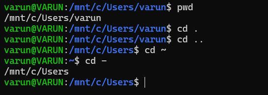
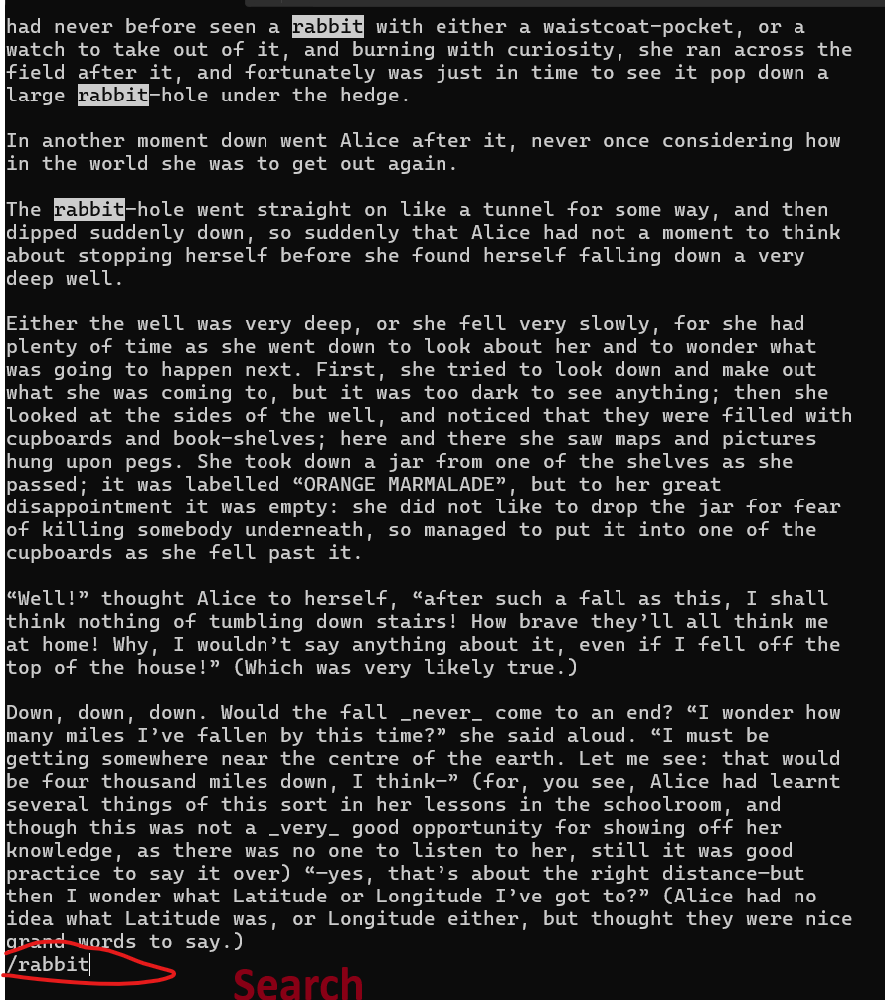

---

# 1. The Shell

The **shell** is a program that takes commands from the keyboard and sends them to the operating system.
Common programs like **Terminal** or **Console** launch a shell.


## Shell Prompt Format

```
username@hostname:current_directory
```

Example:

```
varun@saṅgaṇaka:/home/varun $
```

* `$` → normal user
* `#` → root user


## Command: `echo`

The `echo` command prints text to the screen.

```bash
echo Hello World
```
## Practice:
date and whoami
```bash
varun@VARUN:/mnt/c/Users/varun$ date
Mon Aug 18 05:30:12 UTC 2025

varun@VARUN:/mnt/c/Users/varun$ whoami
varun
```

---

# 2. `pwd` (Print Working Directory)

The Linux filesystem is organized in a **hierarchical directory tree**.
The top directory is the root directory `/`, which contains folders and files.

### Example structure:

```
/
|-- bin
|   |-- file1
|   |-- file2
|-- etc
|   |-- file3
|   `-- directory1
|       |-- file4
|       `-- file5
|-- home
|-- var
```

A **path** shows the location of a file or directory.
Example:

```
/home/varun/Movies
```


## Command: `pwd`

The `pwd` command prints the current directory path.

```bash
varun@saṅgaṇaka:/home/varun $ pwd
/home/varun
```

---


# 3. `cd` (Change Directory)

The `cd` command is used to change your current working directory in the filesystem.


##  Paths in Linux

There are two types of paths you can use with `cd`:

### 1. Absolute Path
- Starts from the **root directory** `/`.
- Always specifies the **full path**.
- Example:
  ```bash
  varun@saṅgaṇaka:/home/varun $ cd /home/varun/Desktop
  ```
  
### 2. Relative Path

- Starts from your current working directory.

- Shorter and easier when already inside a related directory.

- Example:  
    If you are in `/home/varun/Documents` and want to go to `/home/varun/Documents/taxes`, you can simply run:
  ```bash
    varun@saṅgaṇaka:/home/varun/Documents $ cd taxes
  ```
  Other Important Shortcut

| Shortcut | Meaning                         | Example                                         |
| -------- | ------------------------------- | ----------------------------------------------- |
| `.`      | Current directory               | `varun@saṅgaṇaka:/home/varun $ cd .`            |
| `..`     | Parent directory (one level up) | `varun@saṅgaṇaka:/home/varun/Documents $ cd ..` |
| `~`      | Home directory (`/home/varun`)  | `varun@saṅgaṇaka:/home/varun/Documents $ cd ~`  |
| `-`      | Previous directory              | `varun@saṅgaṇaka:/home/varun/Desktop $ cd -`    |




---
# 4. `ls` (List Directory Contents)

The `ls` command is used to list files and directories.


## Basic Usage

By default, `ls` lists the files and directories in your **current working directory**:

```bash
varun@VARUN:/mnt/c/Users$ ls
'All Users'   Default  'Default User'   Public   WsiAccount   desktop.ini   varun
```
You can also specify a path to list the contents of another directory:
```bash
varun@Avya:/mnt/c/Users/varun/mission-22$ cd ../../

varun@Avya:/mnt/c/Users$ ls varun/mission-22
Program1  Program2  Program3  Program4  Program5  Program6

varun@Avya:/mnt/c/Users$ ls -la varun/mission-22
drwxr-xr-x 1 varun varun 4096 Feb  2  2025 .
drwxrwxrwx 1 varun varun 4096 Aug 18 05:34 ..
drwxrwxrwx 1 varun varun 4096 Feb  2  2025 .vscode
drwxrwxrwx 1 varun varun 4096 Feb  3  2025 Program1
drwxrwxrwx 1 varun varun 4096 Feb  3  2025 Program2
drwxrwxrwx 1 varun varun 4096 Feb  3  2025 Program3
drwxrwxrwx 1 varun varun 4096 Feb  3  2025 Program4
drwxrwxrwx 1 varun varun 4096 Feb  1  2025 Program5
drwxrwxrwx 1 varun varun 4096 Feb  3  2025 Program6
```
The first three files were hidden
#### Useful Flags

| Flag           | Meaning                                                             | Example  |
| -------------- | ------------------------------------------------------------------- | -------- |
| `-a`           | Show **all** files, including hidden ones (files starting with `.`) | `ls -a`  |
| `-l`           | Show files in **long format** with details                          | `ls -l`  |
| `-la` or `-al` | Combine both: show hidden files **and** details                     | `ls -la` |


#### What the `ls -l` output means
From left to right:
1. File type & permissions (e.g., `drwxr-x---`)
2. Number of links
3. Owner name (user)
4. Group name
5. File size (in bytes)
6. Last modification date & time
7. File or directory name

### Exercises for `ls`

Try running `ls` with different flags and observe the outputs.  


##### New Flags to Explore

| Command | Meaning |
|---------|---------|
| `ls -R` | Recursively list directory contents (shows files inside subdirectories too) |
| `ls -r` | List in reverse order while sorting |
| `ls -t` | Sort by modification time (newest files first) |

---

# 5. `touch`

Let’s learn how to make some files. A very simple way is to use the touch command. Touch allows you to the create new empty files

```bash
$ touch mysuperduperfile
```

And boom, new file!

**Touch is also used to change timestamps on existing files and directories.** Give it a try, do an ls -l on a file and note the timestamp, then touch that file and it will update the timestamp.


There are many other ways to create files that involve other things like redirection and text editors, but we’ll get to that in the Text Manipulation course.

#### Exercises
1. Create a new file
2. Note the timestamp
3. Touch the file and check the timestamp once again

```bash
varun@Avya:/mnt/c/Linux$ touch newFile

varun@Avya:/mnt/c/Linux$ ls -l myFile
-rwxrwxrwx 1 varun varun 0 Aug 18 11:43 myFile

varun@Avya:/mnt/c/Linux$ touch myFile

varun@Avya:/mnt/c/Linux$ ls -l myFile
-rwxrwxrwx 1 varun varun 0 Aug 18 11:55 myFile
```

---

# 6. `file`
To find out what kind of file a file is, you can use the file command. It will show you a description of the file’s contents.

```bash
$ file banana.jpg
```
Examples:
```bash
varun@Avya:/mnt/c$ file Linux
Linux: directory

varun@Avya:/mnt/c$ file Linux/myFile
Linux/myFile: text
```

---
# 7. `cat`
The `cat` command, short for concatenate, is used to **read and display the contents of files**.  
It can also **combine multiple files** and print their contents together.
```bash
$ cat dogfile
```

#### Exercises
Run cat on different files and directories. Then try to cat multiple files.
```bash
varun@Avya:/mnt/c/Linux$ cat myFile
Hello Varun, How are you??

varun@Avya:/mnt/c/Linux$ cat newFile
I'm fine man!!! How are you??

varun@Avya:/mnt/c/Linux$ cat myFile newFile
Hello Varun, How are you??
I'm fine man!!! How are you??
```
# 8. `less`

The `less` command is used to **view larger text files** in a paged manner.  
Unlike `cat`, it doesn’t dump the whole file at once — you can **scroll and search** inside the file.

```bash
$ less /home/Documents/text1
```
Other impoortant keys
| Key                   | Action                                                   |
| --------------------- | -------------------------------------------------------- |
| `q`                   | Quit and return to the shell                             |
| `↑` / `↓`             | Scroll up and down line by line                          |
| `PageUp` / `PageDown` | Scroll a whole page                                      |
| `g`                   | Jump to the **beginning** of the file                    |
| `G`                   | Jump to the **end** of the file                          |
| `/search`             | Search for specific text (type `/word` then press Enter) |
| `n`                   | Repeat the last search (next match)                      |
| `h`                   | Show help while inside `less`                            |





---

# 9. `history`
shows a numberes list of commands you've run before:
```bash
history
```
Example:
```bash
varun@Avya:~ $ history
   45  ls
   46  cd playground
   47  pwd
   48  less alice.txt
```
You can even re-run bu number:
```bash
!45
```
(runs the cmd at history entry 45)

##### Shortcurts
- ↑ / ↓ arrows → cycle through previous commands  
- !! → repeat last command  
- !ls → repeat the last command starting with ls  
- Ctrl + R → reverse search your history, type part of the command, press Ctrl+R again to cycle  

`clear`
Cleans up your screen but doesn't erase history

---
# 10. `cp(Copy)`
The cp command is used to copy files and directories.
Basic usage:
**cp source destination**
```bash
$ cp mycoolfile /home/avya/Documents/cooldocs
```

Copies mycoolfile into the cooldocs folder.

Copying multiple files with wildcards

- `*` → matches any string

- `?` → matches one character

- `[]` → matches any character in the brackets

Examples:
```bash
$ cp *.jpg /home/avya/Pictures  #copies all.jpg files into Pictures folder

$ cp file?.txt /home/avya/Documents   #This matches file1.txt, fileA.txt, file_.txt

$ cp file[123].txt /home/avya/Documents   #Matches file1.txt, file2.txt, file3.txt

$ cp file[a-c].txt /home/avya/Documents   #Matches filea.txt, fileb.txt, filec.txt
```

`copying directories`
By default cp only works for files. To copy folders, use -r (recursive):
```bash
$ cp -r Pumpkin/ /home/avya/Documents    #Copies the whole Pumpkin folder and its contents.
```

`Avoid overwriting files`

Use `-i` (interactive) so you’re asked before overwriting:
```bash
$ cp -i mycoolfile /home/avya/Pictures
```
---

# 11. `mv` (Move / Rename)

The `mv` command is used to **move files or directories** to another location, or **rename** them.  
It works very similarly to `cp`, including the use of flags.

---

### Rename a file
```bash
varun@Avya:/home/varun $ mv oldfile newfile
```
Move a file to another directory
```bash
varun@Avya:/home/varun $ mv file2 /home/avya/Documents
```
Move multiple files
```bash
varun@Avya:/home/varun $ mv file_1 file_2 /home/avya/Documents
```

Rename a directory
```bash
varun@Avya:/home/varun $ mv directory1 directory2
```

#### Flags
| Flag | Meaning                                        | Example             |
| ---- | ---------------------------------------------- | ------------------- |
| `-i` | Interactive: prompt before overwriting         | `mv -i file1 file2` |
| `-b` | Backup: if overwriting, save old file with `~` | `mv -b file1 file2` |

---
# 12. `mkdir (Make Directory)`
We’re gonna need some directories to store all these files we’ve been working on. The mkdir command (Make Directory) is useful for that, it will create a directory if it doesn’t already exist. You can even make multiple directories at the same time.

```bash
$ mkdir books paintings
```
You can also create subdirectories at the same time with the -p (parent flag).
```bash
$ mkdir -p books/hemmingway/favorites
```
---
# 13. `rm` (Remove / Delete Files)

The `rm` command is used to **delete files and directories**.  
⚠️ Be careful: there is **no trash can** — once deleted, files are gone unless you have a backup.


### Remove a single file
```bash
varun@Avya:/home/varun $ rm file1
```

Flags

| Flag | Meaning                                                  | Example          |
| ---- | -------------------------------------------------------- | ---------------- |
| `-f` | Force: delete without prompting, even if write-protected | `rm -f file1`    |
| `-i` | Interactive: ask before deleting                         | `rm -i file1`    |
| `-r` | Recursive: delete a directory and all its contents       | `rm -r myfolder` |

Remove directories
```bash
varun@Avya:/home/varun $ rmdir emptyfolder
```
---
# 14. `find`

The `find` command is used to **search for files and directories** in a directory hierarchy.  
It recursively searches through subdirectories by default.


### Find a file by name
```bash
varun@Avya:/home/varun $ find /home -name puppies.jpg
```
### Find directories by type and name
```bash
varun@Avya:/home/varun $ find /home -type d -name MyFolder
```
- `-type d` → only look for directories (f = files)

- `-name MyFolder` → directory name to search for

Examples:
```bash
varun@Avya:/home/varun $ find ~/Documents -type f -name "*.txt"   # find all .txt files

varun@Avya:/home/varun $ find ~/ -type d -name "Projects"         # find all directories named Projects
```

---
# 15. `help`

Linux provides **built-in tools** to learn how to use commands and see available flags.  
The `help` command is a **bash built-in** that gives information about other bash commands.

---


### Using `help` on a bash command
```bash
$ help echo
```
- Shows a description of the command (echo)
- Lists all options you can use with it

## Using --help for executables

For many executable programs (not bash built-ins), you can use:
```bash
$ echo --help
```
- Provides usage instructions and available options
- Note: Not all programs follow this convention, but it’s widely used

Examples:
```bash
varun@Avya:/home/varun $ help cd         # learn about changing directories
varun@Avya:/home/varun $ ls --help      # see all flags and options for ls
```
---
# 16. `man`
Gee I wish some of these programs had a manual so we can see some more information about them. Well luckily they do! Aptly named man pages, you can see the manuals for a command with the man command.
```bash
$ man ls
```

Man pages are manuals that are by default built into most Linux operating systems. They provide documentation about commands and other aspects of the system.

---
# 17. `whatis`
Whew, we’ve learned quite a bit of commands so far, if you are ever feeling doubtful about what a command does, you can use the whatis command. The whatis command provides a brief description of command line programs.
```bash
$ whatis cat
```
The description gets sourced from the manual page of each command. If you ran whatis cat, you’d see there is a small blurb with a short description.

---
# 19 `exit`

Well, you sure did a good job getting through the basics. We’ve only scratched the surface, now that you’ve learned to crawl, in the next set of courses, I’m gonna teach how to walk.

For now, you can pat yourself on the back and take a break. To exit from the shell, you can use the exit command
```bash
$ exit
```
Or the logout command:
```bash
$ logout
```
Or if you are working out of a terminal GUI, you can just close the terminal
